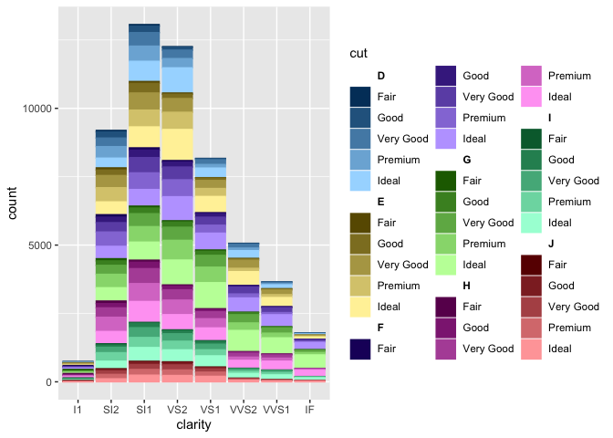
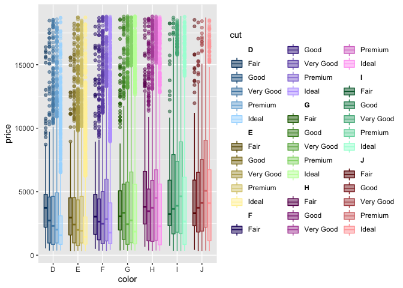
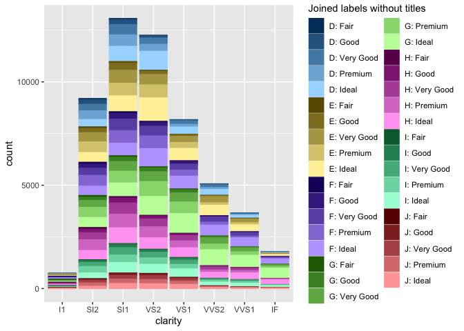
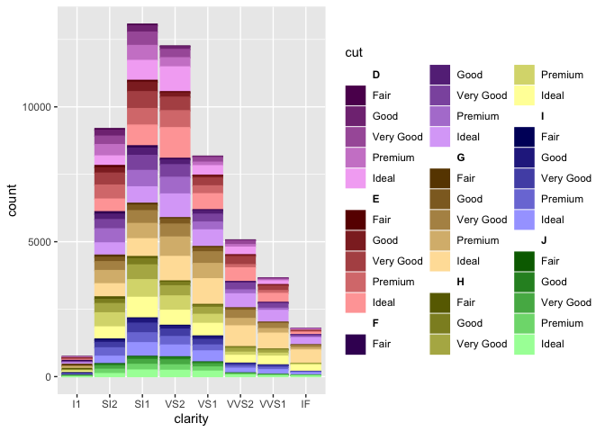
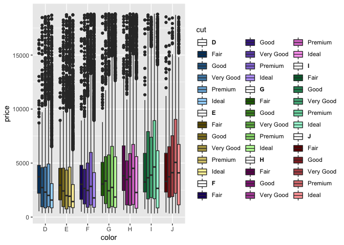
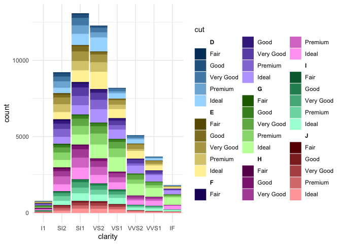

<!-- README.md is generated from README.Rmd. Please edit that file -->

# ggnested

`ggnested` is a wrapper function around `ggplot2` that enables users to
display data with a two-level nested or clustered structure. It uses
colours or fills to label the main group or cluster, and a gradient of
shades and tints of each colour to label subgroups within each main
group. It is particularly useful for data with a hierarchy, such as
taxonomic annotations or geographic locations.

This is one of the core functions of the `fantaxtic` package, which
visualizes taxonomic ranks of amplicon sequencing / microbiome data as
stored in `phyloseq` objects. However, as it has utility beyond
displaying taxonomic annotations, it has been implemented as a separate
package.

**Keywords: R, ggplot2, nested data, clustered data, multiple levels,
shades, tints, gradient**

## Installation

``` r
if(!"devtools" %in% installed.packages()){
  install.packages("devtools")
}
devtools::install_github("gmteunisse/ggnested")
```

## Usage

### Basic

`ggnested` can be used exactly like the regular `ggplot` function, but
with some extra arguments. Instead of specifying a color or a fill, a
`main_group` and a `sub_group` need to be specified in the aesthetic
mapping through `aes(...)`. The ggplot object can then be used to create
any regular ggplot plot, such as barplots, scatterplots or boxplots, as
well as any other layers such as faceting.

``` r
library(ggnested)
data(diamonds)
```

``` r
ggnested(diamonds, 
         aes(clarity, 
             main_group = color, 
             sub_group = cut)) + 
  geom_bar()
```

<!-- -->

``` r
ggnested(diamonds, 
         aes(x = carat, 
             y = price, 
             main_group = color, 
             sub_group = cut)) + 
  geom_point(alpha = 0.5) +
  facet_wrap(~color)
```

<!-- -->

``` r
ggnested(diamonds, 
         aes(x = color,
             y = price, 
             main_group = color, 
             sub_group = cut)) + 
  geom_boxplot(alpha = .5)
```

<!-- -->

### Options

A few options are available, most of which are related to the appearance
of the plot.

#### Legend

A few options are available to alter the way the legend is constructed.

-   The `legend_labeling` option alters the labels that are used in the
    legend. For example, it is possible to display both the `main_group`
    label and the `sub_group` label, or just the `main_group` label.
-   The `join_str` option is used if `legend_labeling = "join"`,and
    specifies a string to join the two labels.
-   The `legend_title` option alters the legend title.
-   The `main_keys` determines whether `main_group` labels are displayed
    as keys within the legend.

Bringing it all together:

``` r
ggnested(diamonds, 
         aes(clarity, 
             main_group = color, 
             sub_group = cut),
         legend_labeling = "join",
         join_str = ": ",
         legend_title = "Joined labels without titles",
         main_keys = FALSE) + 
  geom_bar()
```

<!-- -->

#### Colour palette

`ggnested` creates its own colour palettes. Like ggplot2, it samples
maximally separated colours, but unlike ggplot2, it shuffles the palette
so that dissimlar colours are placed next to one another. This is to
avoid confusion in colours and shades between different groups. Also
unlike ggplot2, the user can define a base colour
(e.g. `base_clr = #008CF0`) that serves as the first colour of the
palette, based on which all other colours are sampled. Finally, A custom
palette of colours for the `main_group` can be provided
(`main_palette = c()`), which will then be used to generate gradients
for the subgroups.

``` r
ggnested(diamonds, 
         aes(clarity, 
             main_group = color, 
             sub_group = cut),
         base_clr = "red") + 
  geom_bar()
```

<!-- -->

Note that if a custom palette is named, the colours will be associated
with the appropriate `main_group` level.

``` r
pal <- c("red", "blue", "green", "yellow", "purple", "orange", "grey50")
names(pal) <- unique(diamonds$color)
p <- ggnested(diamonds, 
         aes(clarity, 
             main_group = color, 
             sub_group = cut), 
         main_palette = pal) + 
  geom_bar()
p
```

<!-- -->

The colour palette can also be extracted from the ggplot2 object using
`extract_palette`.

``` r
extract_palette(p)
#> # A tibble: 35 x 3
#>    group_subgroup group_colour subgroup_colour
#>    <ord>          <chr>        <chr>          
#>  1 D - Fair       grey50       #333333        
#>  2 D - Good       grey50       #595959        
#>  3 D - Very Good  grey50       #7F7F7F        
#>  4 D - Premium    grey50       #A6A6A6        
#>  5 D - Ideal      grey50       #CCCCCC        
#>  6 E - Fair       red          #660000        
#>  7 E - Good       red          #B20000        
#>  8 E - Very Good  red          #FF0000        
#>  9 E - Premium    red          #FF4D4D        
#> 10 E - Ideal      red          #FF9999        
#> # ... with 25 more rows
```

It’s also possible to create your own nested palette for other purposes:

``` r
nested_palette(diamonds,
               group = "color",
               subgroup = "cut")
#> # A tibble: 35 x 5
#>    color cut       group_colour subgroup_colour group_subgroup
#>    <ord> <ord>     <chr>        <chr>           <chr>         
#>  1 D     Fair      #008CF0      #003C66         D_Fair        
#>  2 D     Good      #008CF0      #0068B2         D_Good        
#>  3 D     Very Good #008CF0      #0095FF         D_Very Good   
#>  4 D     Premium   #008CF0      #4DB5FF         D_Premium     
#>  5 D     Ideal     #008CF0      #99D5FF         D_Ideal       
#>  6 E     Fair      #F0CB00      #665600         E_Fair        
#>  7 E     Good      #F0CB00      #B29700         E_Good        
#>  8 E     Very Good #F0CB00      #FFD800         E_Very Good   
#>  9 E     Premium   #F0CB00      #FFE34D         E_Premium     
#> 10 E     Ideal     #F0CB00      #FFEF99         E_Ideal       
#> # ... with 25 more rows
```

#### Affected aethetics

By default, both the `color` and `fill` aesthetics of the plot are
altered by `ggnested`. However, it is possible to specify which
aesthetics should be altered using `nested_aes = c("fill", "colour")`.
Note that it leads to issues with the legends of geoms that
automatically create both `colour` and `fill` aethetics, as shown with
the boxplots below - the `main_group` titles now also show a box
outline! This can of course be resolved by setting `main_keys = FALSE`
as shown above.

``` r
ggnested(diamonds, 
         aes(x = color,
             y = price, 
             main_group = color, 
             sub_group = cut),
         nested_aes = "fill") + 
  geom_boxplot()
```

<!-- -->

### Themes

To ensure that a `ggnested` plot does not alter when the theme is
altered, it is recommended to alter the theme using the `theme_nested`
function. This function is simply a wrapper around any ggplot `theme_*`
function.

``` r
ggnested(diamonds, 
         aes(clarity, 
             main_group = color, 
             sub_group = cut)) + 
  geom_bar() +
  theme_nested(theme_minimal)
```

<!-- -->
